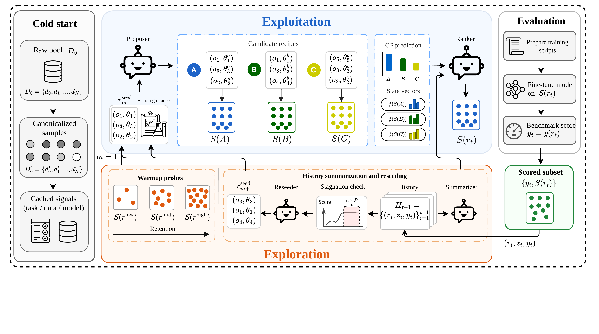

# From Instance Selection to Fixed-Pool Data Recipe Search for Supervised Fine-Tuning

AutoSelection is a budgeted solver for fixed-pool data recipe search. Instead
of treating SFT data selection as a one-shot instance ranking problem, it
searches over executable data-curation recipes that filter, mix, deduplicate,
and recombine samples from the same fixed raw instruction pool.

<p align="center">
  <a href="resources/main.pdf">
    
  </a>
</p>

## Abstract

Supervised fine-tuning (SFT) data selection is commonly formulated as instance
ranking: score each example and retain a top-k subset. However, effective SFT
training subsets are often produced through ordered curation recipes, where
filtering, mixing, and deduplication operators jointly shape the final data
distribution. We formulate this problem as fixed-pool data recipe search: given
a raw instruction pool and a library of grounded operators, the goal is to
discover an executable recipe that constructs a high-quality selected subset
under a limited budget of full SFT evaluations, without generating, rewriting,
or augmenting training samples. We introduce AutoSelection, a two-layer solver
that decouples fixed-pool materialization based on cached task-, data-, and
model-side signals from expensive full evaluation, using warmup probes,
realized subset states, local recipe edits, Gaussian-process-assisted ranking,
and stagnation-triggered reseeding. Experiments on a 90K instruction pool show
that AutoSelection achieves the strongest in-distribution reasoning average
across three base models, outperforming full-data training, random recipe
search, random top-k, and single-operator selectors. Additional
out-of-distribution graph-reasoning results, search-stability analyses,
structural ablations, and 1.5B-to-7B transfer checks further show that recipe
structure matters beyond individual selection operators.

## Method Overview

AutoSelection has two coupled layers:

- Fixed-pool materialization: canonicalizes the raw instruction pool once,
  preserves stable sample identifiers, and precomputes reusable task-, data-,
  and model-side signals. Operators always return subsets of the same fixed
  pool; they do not generate, rewrite, or augment examples.
- Search controller: allocates a limited evaluation budget through warmup
  probes, history summarization, local recipe edits, candidate materialization,
  GP-assisted ranking, and stagnation-triggered reseeding.

A recipe is a bounded ordered program:

```text
[(operator_1, params_1), ..., (operator_L, params_L)]
```

Executing a recipe materializes a selected subset. An evaluation then fine-tunes
the base model on that subset and measures downstream benchmark performance.
`MAX_EVALUATIONS` is therefore the primary search budget.

For each materialized candidate, AutoSelection computes a realized subset state
vector before spending an evaluation. The state vector summarizes retained data
scale, token ratio, task relevance, per-benchmark MONA similarity,
distribution drift, IFD, and varentropy. This gives the ranker information
about what the recipe actually produced, not only what operators appear in the
recipe string.

## Repository Layout

```text
data/
  train3/merged_data.jsonl              # default training pool
  target_vector_samples/*.jsonl         # target-vector data for MONA/SAE scoring
  eval/*.jsonl                          # in-domain and OOD evaluation sets
examples/
  recipes/operator_catalog.yaml         # operator prompt/search catalog
  extensions/                           # minimal custom-operator example
resources/
  main.pdf                              # method figure source
  main.png                              # README preview image
runs/
  run_mcts_e2e.sh                       # main AutoSelection search entrypoint
  run_mcts_e2e_engine.py                # Python engine used by the shell entrypoint
  run_ood_eval.sh                       # OOD evaluation entrypoint
  run_multi_ckpt_eval.py                # multi-checkpoint evaluation helper
src/recipe_sandbox/                     # package source code
tests/                                  # smoke tests
```

The main search script names are kept for backward compatibility with earlier
experiments; the active method is AutoSelection's warmup, local-edit, ranking,
and reseeding loop.

## Environment Setup

Use Python 3.10 or newer. The two core runtime dependencies are:

```text
LLaMA-Factory 0.9.5.dev0
vLLM          0.10.0
```

Install the accelerator-specific `torch` build that matches your CUDA/NPU
cluster, then install the supporting Python packages used by the pipeline.

```bash
conda create -n autosel python=3.10 -y
conda activate autosel
pip install -U pip

pip install numpy scipy scikit-learn pyyaml tqdm pandas pyarrow datasets openai
pip install torch transformers accelerate peft deepspeed
pip install vllm==0.10.0 llamafactory==0.9.5.dev0
```

For Ascend/NPU environments, also install the matching `torch-npu` package and
set `ASCEND_RT_VISIBLE_DEVICES` as needed. For CUDA environments, set
`CUDA_VISIBLE_DEVICES` as usual.

Check the basic runtime:

```bash
python -c "import sklearn, torch, transformers, vllm; print(vllm.__version__)"
llamafactory-cli --help
```

## Model and Agent Configuration

By default the scripts expect:

```text
models/base_model
models/sae/layers.27
```

Override them with environment variables:

```bash
export BASE_MODEL=/path/to/base_model
export SAE_PATH=/path/to/sae/layers.27
```

## SAE Training

AutoSelection consumes SAE features during cold-start scoring and subset-state
construction. This repository assumes an SAE checkpoint already exists at
`SAE_PATH`; train or reuse that artifact before launching the search.

The SAE checkpoints used for the paper experiments are released on HuggingFace:

| Base model | SAE checkpoint |
| --- | --- |
| Qwen2.5-1.5B | [k253/Qwen2.5-1.5B-sae](https://huggingface.co/k253/Qwen2.5-1.5B-sae) |
| Qwen2.5-3B | [k253/Qwen2.5-3B-sae](https://huggingface.co/k253/Qwen2.5-3B-sae) |
| Llama3.2-1B | [k253/Llama3.2-1B-sae](https://huggingface.co/k253/Llama3.2-1B-sae) |

Download the SAE that matches your base model and point `SAE_PATH` to the
downloaded checkpoint directory:

```bash
huggingface-cli download k253/Qwen2.5-3B-sae \
  --local-dir models/sae/qwen2.5-3b

export SAE_PATH=models/sae/qwen2.5-3b/layer.27
```

We recommend [EleutherAI/sparsify](https://github.com/EleutherAI/sparsify) for
SAE training. Its README describes a lightweight library for training k-sparse
SAEs and transcoders on HuggingFace language-model activations, computing
activations on the fly instead of caching them to disk. The same tool supports
CLI training, custom hookpoints, finetuning existing SAEs, and distributed
training through `torchrun`.

Install sparsify separately:

```bash
pip install eai-sparsify
```

Minimal training pattern:

```bash
python -m sparsify /path/to/base_model /path/to/hf_dataset \
  --hookpoints "layers.27"
```

For multi-GPU jobs, sparsify supports `torchrun`; for example:

```bash
torchrun --nproc_per_node gpu -m sparsify /path/to/base_model \
  --layers 27 \
  --batch_size 1 \
  --grad_acc_steps 8 \
  --ctx_len 2048
```

After training, point `SAE_PATH` to the layer artifact consumed by this codebase,
for example `models/sae/layers.27`.

AutoSelection's proposer, summarizer, and ranker use an OpenAI-compatible LLM
endpoint:

```bash
export OPENAI_BASE_URL=https://your-openai-compatible-endpoint/v1
export OPENAI_API_KEY=your_api_key
export LLM_MODEL=your_model_name
export THINKING_MODEL=${LLM_MODEL}
```

`THINKING_MODEL` is used by the Action, Feedback, and Selection agents. If it
is not set, it defaults to `LLM_MODEL`.

## Data Setup

Default paths are relative to the repository root:

```text
data/train3/merged_data.jsonl
data/target_vector_samples/gpqa_ext_98.jsonl
data/target_vector_samples/gsm8k_train_100.jsonl
data/target_vector_samples/bbh_few_shot.jsonl
data/target_vector_samples/mmlu_val.jsonl
data/eval/gpqa_main.jsonl
data/eval/gsm8k_test.jsonl
data/eval/bbh_test.jsonl
data/eval/mmlu_test.jsonl
data/eval/GraphWiz_test.jsonl
data/eval/NLgraph_test.jsonl
```

The eval and target-vector files are included in the repository. The 90K
training pool is hosted separately on HuggingFace:
[k253/AutoSelection-90k](https://huggingface.co/datasets/k253/AutoSelection-90k).
Download it to the default path `data/train3/merged_data.jsonl`, or set
`RAW_TRAIN_DATA` to another local JSONL file before running AutoSelection.

```bash
huggingface-cli download k253/AutoSelection-90k merged_data.jsonl \
  --repo-type dataset \
  --local-dir data/train3
```

Training data should be JSONL in canonical chat format. Each line should
contain at least a `messages` list with `{role, content}` objects. Optional
fields such as `sample_id`, `source_name`, `target`, `metadata`, and `tags` are
supported. See `src/recipe_sandbox/schema/canonical_schema.yaml` for the full
schema.

Use another training pool:

```bash
RAW_TRAIN_DATA=/path/to/train.jsonl bash runs/run_mcts_e2e.sh
```

Use another data root:

```bash
DATA_DIR=/path/to/data bash runs/run_mcts_e2e.sh
```

## Run AutoSelection

```bash
cd /path/to/AutoSelection

export BASE_MODEL=/path/to/base_model
export SAE_PATH=/path/to/sae/layers.27
export OPENAI_BASE_URL=https://your-openai-compatible-endpoint/v1
export OPENAI_API_KEY=your_api_key
export LLM_MODEL=your_model_name

bash runs/run_mcts_e2e.sh
```

Common overrides:

```bash
MAX_EVALUATIONS=15 \
N_LHS_SEEDS=3 \
NUM_EPOCHS=3.0 \
STAGNATION_PATIENCE=4 \
OPERATOR_CATALOG=examples/recipes/operator_catalog.yaml \
TENSOR_PARALLEL_SIZE=1 \
bash runs/run_mcts_e2e.sh
```

`MAX_EVALUATIONS` is the number of completed evaluations the search may run.
Runtime is still recorded for diagnostics, but it is not used as the stopping
budget.

Use a custom DeepSpeed config:

```bash
DEEPSPEED_CONFIG=/path/to/ds_zero2.json bash runs/run_mcts_e2e.sh
```

Resume a previous run:

```bash
OUTPUT_DIR=runs/e2e_mcts_YYYYMMDD_HHMMSS RESUME=1 bash runs/run_mcts_e2e.sh
```

Reuse SAE/canonical cache from a previous run:

```bash
SAE_CACHE_FROM=runs/e2e_mcts_YYYYMMDD_HHMMSS bash runs/run_mcts_e2e.sh
```

Main outputs are written under `runs/e2e_mcts_*` or the `OUTPUT_DIR` you set:

```text
engine.log
experiment_*.log
search_log.jsonl
search_tree.json
operator_catalog.extended.yaml   # only when extension catalog patches are used
thinking_logs/
recipes/
canonical/
sae_caches/
```

## Evaluation Utilities

OOD evaluation uses:

```text
graphwiz        -> data/eval/GraphWiz_test.jsonl
nlgraph_yesno  -> data/eval/NLgraph_test.jsonl
```

Evaluate a full model:

```bash
MODEL_PATH=/path/to/full_model bash runs/run_ood_eval.sh
```

Evaluate a LoRA adapter with a base model:

```bash
MODEL_PATH=/path/to/base_model \
LORA_PATH=/path/to/adapter \
bash runs/run_ood_eval.sh
```

Evaluate multiple checkpoints:

```bash
python runs/run_multi_ckpt_eval.py \
  --base_model_path /path/to/base_model \
  --checkpoints /path/to/adapter1 /path/to/adapter2 \
  --tasks gpqa,gsm8k,bbh,mmlu,graphwiz,nlgraph_yesno \
  --output_dir runs/multi_ckpt_eval
```

For sharded evaluation:

```bash
python runs/run_multi_ckpt_eval.py \
  --checkpoints /path/to/ckpt \
  --tasks gpqa,gsm8k,bbh,mmlu,graphwiz,nlgraph_yesno \
  --num_shards 4 \
  --device_ids 0,1,2,3 \
  --output_dir runs/multi_ckpt_eval
```

## Extending Operators and Hooks

New operators should subclass `BaseOperator` or one of its typed bases in
`src/recipe_sandbox/operators/base.py`, then register through a small extension
module on `PYTHONPATH`.

```python
from recipe_sandbox.operators.base import FilterOperator


class MyFilter(FilterOperator):
    name = "my_filter"
    version = "v1"

    def transform(self, dataset):
        return list(dataset)


def register_operators(registry):
    registry.register(MyFilter)
```

Run with:

```bash
EXTENSION_MODULES=examples.extensions.dummy_extension \
OPERATOR_CATALOG=/path/to/operator_catalog.yaml \
bash runs/run_mcts_e2e.sh
```

For AutoSelection's LLM-guided search, the operator must also have prompt
metadata. You can either add it to the catalog passed via `OPERATOR_CATALOG`, or
expose an `OPERATOR_CATALOG_PATCH` / `get_operator_catalog_patch()` from the
extension module. At runtime the patch is merged into
`operator_catalog.extended.yaml` in the run directory and passed to the
proposer. The registry controls execution; the catalog controls how the
proposer talks about the operator.

If a new operator needs cold-start features, expose:

```python
def precompute_features(*, samples, context):
    for sample in samples:
        sample.metadata.extra["my_feature"] = {"score": 0.0}
    return {"feature_key": "my_feature", "samples": len(samples)}
```

This runs after built-in scoring/SAE ingest and before warmup/search execution,
so operators can consume the cached metadata during `transform()`. Keep
expensive metric computation in `precompute_features()` and keep `transform()`
deterministic.

Extension operators are appended to the search vocabulary automatically. The
surrogate uses a generic numeric intensity feature for unknown operators; add a
dedicated branch in `ANOVARegressor._encode_operator()` if a new operator needs
custom features.

Recipe execution hooks can observe lifecycle events without changing each
operator. An extension module may expose `get_recipe_hooks()` or `RECIPE_HOOKS`.
Hook objects can implement any subset of:

```text
before_recipe(recipe, bus, state)
after_recipe(recipe, result)
before_step(recipe, step, step_index, operator, bus, state_before, step_context)
after_step(recipe, step, step_index, operator, bus_before, bus_after, step_trace)
on_step_error(recipe, step, step_index, bus, error)
```

Use hooks for logging, validation, telemetry, or experiment bookkeeping. Put
data transformations in operators so traces and manifests stay reproducible.

## Quick Checks

```bash
bash -n runs/run_mcts_e2e.sh
bash -n runs/run_ood_eval.sh
python -m compileall -q runs src
PYTHONPATH=src:. python -m unittest tests.test_extensions_smoke
```

If `run_mcts_e2e_engine.py --help` fails with `ModuleNotFoundError:
No module named 'sklearn'`, install `scikit-learn` in the active environment.

## Citation

```bibtex
@misc{wu2026instanceselectionfixedpooldata,
      title={From Instance Selection to Fixed-Pool Data Recipe Search for Supervised Fine-Tuning},
      author={Haodong Wu and Jiahao Zhang and Lijie Hu and Yongqi Zhang},
      year={2026},
      eprint={2605.12944},
      archivePrefix={arXiv},
      primaryClass={cs.LG},
      url={https://arxiv.org/abs/2605.12944},
}
```
